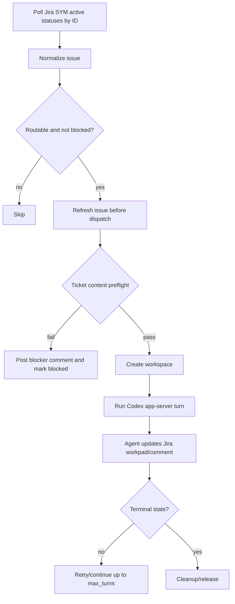

# Symphony Codex Squad Modification Spec

> Date: 2026-06-27
> Status: In progress
> Scope owner: Symphony headless orchestrator for SYM Jira

## 1. One-line Goal

Make Symphony usable like a Codex squad runner for SYM Jira tickets: structured ticket intake, headless dispatch, role/model evidence, verifier gates, and Docker Compose operation without the Symphony UI.

## 2. Background

The fork now supports Jira polling, comments, state transitions, Docker Compose headless startup, ticket preflight, a `squad.check` evidence gate, and sequential role-specific Codex app-server sessions with configured model overrides. The remaining risk is hardening failure recovery across Compose restarts and broad live tickets.

## 3. Scope

### Included

- SYM Jira ticket body contract and preflight validation.
- Reusable `sym-jira-ticket` Codex skill for creating/checking ticket bodies.
- Jira status ID polling and safe success-terminal transition preference.
- Evidence file validation for `cto`, `implementer`, `verifier`, and `final_verifier` roles.
- Headless Docker Compose deployment path.
- Documentation, local test evidence, and remaining implementation boundaries.

### Excluded

- Symphony UI work.
- Raw token storage in tracked files.
- Automatic live Jira mutations except explicit smoke tests.
- Full production hardening of remote worker fleets.

## 4. Ticket Content Contract

A dispatchable ticket description must include:

```md
## Background
## Goal
## Scope
## Acceptance Criteria
## Validation
## Agent Flow
## Handoff Evidence
```

Minimum mechanical gate for unattended dispatch:

- `Background`, `Scope`, `Acceptance Criteria`, and `Validation` must exist.
- `Acceptance Criteria` must contain checklist items.
- `Validation`, `Test Plan`, or `Testing` must contain checklist items.
- Missing or empty required sections block dispatch and write a blocker comment.

### 4.1 Long-body validator behavior (future agent notes)

When changing ticket shape validation (`SymphonyElixir.Ticket.ContentCheck`) use only generated synthetic fixtures and keep strictness unchanged.

- Use long synthetic bodies of at least 50 KB and preferably around 100 KB when reproducing slow-path behavior.
- Keep required section names stable (`Background`, `Scope`, `Acceptance Criteria`, `Validation`) and do not weaken checklist requirements in any section.
- For direct in-repo validation (`ContentCheck.validate/2` and `mix ticket.check --strict`), enforce a guardrail budget of ~2 seconds in tests.
- When wrapping an external validator process, cap the whole validation call at ~5 seconds and fail fast with an actionable error if the boundary is reached.
- A malformed long fixture should fail with a specific contract message (for example, `section ## Validation must include checklist items`) instead of hanging.
- The in-repo validator now supports `validation_timeout_ms` to force bounded behavior in tests and tooling; callers should default to a small timeout and return a clear `...timed out...` error rather than hanging.
- If the Python `sym-jira-ticket` surface is available in the workspace, run both validators on the same generated valid and malformed long fixtures and keep results aligned in evidence. If unavailable, document the missing tooling in the workpad as a hard blocker.

## 5. Role / Model Flow

| Role | Model | Responsibility | Current enforcement |
|---|---|---|---|
| CTO | `gpt-5.5` | Scope, risks, plan, acceptance criteria | Evidence section must mention role/model |
| Implementer | `gpt-5.3-codex-spark` | Bounded implementation and local checks | Evidence section must mention role/model |
| Verifier | `gpt-5.4` | Independent behavior/regression check | `PASS` row required |
| Final verifier | `gpt-5.5` | Scope/evidence/residual-risk decision | `PASS` row required |

Current implementation starts a separate Codex app-server session per role when `agent.squad_enabled` is true and injects that role's configured model into the command before `app-server`. The evidence gate still verifies handoff shape after the role turns complete.

## 6. Dispatch Flow



## 6.1 One-ticket E2E Operator Flow

For live Codex smoke runs, do not start the default Compose service against all active SYM statuses unless the active queue is intentionally ready. Use a temporary workflow copy with a ticket-specific required label set, then mount that file over `/app/elixir/WORKFLOW.md` in a temporary Compose file.

Recommended flow:

1. Add two narrow labels to the selected ticket, for example `symphony-e2e` and a fix-specific label.
2. Copy `elixir/WORKFLOW.md` to `.tmp/WORKFLOW-<ticket>.md` and set `tracker.required_labels` to those labels.
3. Start Compose with a temporary file that mounts `.tmp/WORKFLOW-<ticket>.md` over `/app/elixir/WORKFLOW.md`.
4. Verify `docker compose logs` shows exactly one running issue before letting the run continue.
5. After completion or blocker, capture Jira status, workspace `git status --short`, and squad evidence validation if a diff was produced.

No-diff guard behavior:

- Normal tracker workpad comment writes from app-server are rejected until the workspace has a code, test, docs, or `docs/codex-squad-evidence.md` diff.
- A `### Runtime Blocker` comment remains allowed before a diff so agents can stop early with a concrete blocker.
- `codex.max_no_diff_tokens` is disabled when set to `0`; unattended live runs can use that value to allow long-running agents without the no-diff token blocker.

## 7. Acceptance Criteria

- [x] Jira SYM polling uses status IDs when configured.
- [x] Jira comments and transitions work against the live SYM project.
- [x] Headless fake app-server E2E completes Jira poll -> workspace -> turn -> transition -> cleanup.
- [x] `squad.check` passes valid role/model evidence.
- [x] `squad.check` fails when a required verifier PASS is missing.
- [x] Ticket content preflight can be configured from `WORKFLOW.md`.
- [x] `mix ticket.check` validates ticket markdown by strict defaults or workflow config.
- [x] Jira generic success transition requests prefer `해결됨`/`완료` over `취소`.
- [x] Real Codex multi-model squad orchestration starts each role in a distinct Codex app-server model context.
- [x] Missing verifier/final_verifier PASS fails the evidence gate and prevents successful squad handoff.
- [x] Compose restart recovery is validated against persisted workspaces and persisted tracker blockers.

## 8. Implementation Plan

### Phase 1: Guardrails and reusable intake

- Add `SymphonyElixir.Ticket.ContentCheck`.
- Add `ticket:` workflow config and dispatch preflight.
- Add `mix ticket.check`.
- Add `sym-jira-ticket` skill.
- Update SYM `WORKFLOW.md` to enable strict ticket preflight.

### Phase 2: Runtime squad orchestration

- Introduce a squad run artifact model: CTO plan, implementation result, verifier result, final verdict.
- Extend app-server orchestration to start isolated role turns with explicit model overrides when supported by the Codex runtime.
- Persist role outputs into a single evidence markdown artifact.
- Require `squad.check` before success handoff/terminal transition.

### Phase 3: Failure and recovery hardening

- Define verifier FAIL -> rework loop.
- Define final verifier FAIL -> blocked or rework based on cause.
- Test Jira permission loss, transition failure, app-server failure, and Compose restart.

## 9. Verification Plan

- Unit: ticket content parser, config schema, Jira transition preference, evidence gate.
- Mix tasks: `ticket.check`, `squad.check` positive and negative paths.
- Integration: fake app-server full orchestration against Jira smoke issue.
- Live: real Codex E2E only after phase-2 role process isolation is implemented.

## 10. Current Known Limits

- The evidence gate proves role/model evidence shape, not that separate model instances truly executed.
- Current preflight validates section structure, not requirement quality.
- Jira request type metadata is known for SYM but not yet bundled as a machine-readable repo artifact beyond the skill reference.
- `WORKFLOW.md` still contains some legacy PR/branch process language where repo-specific handoff behavior depends on the target project.
